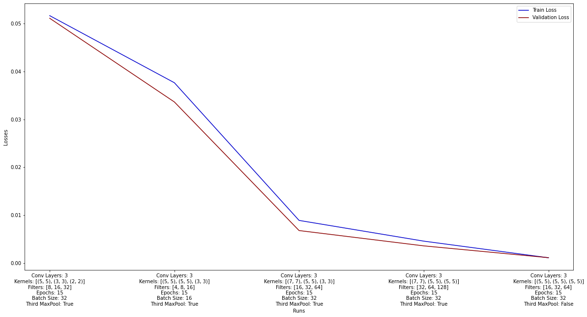
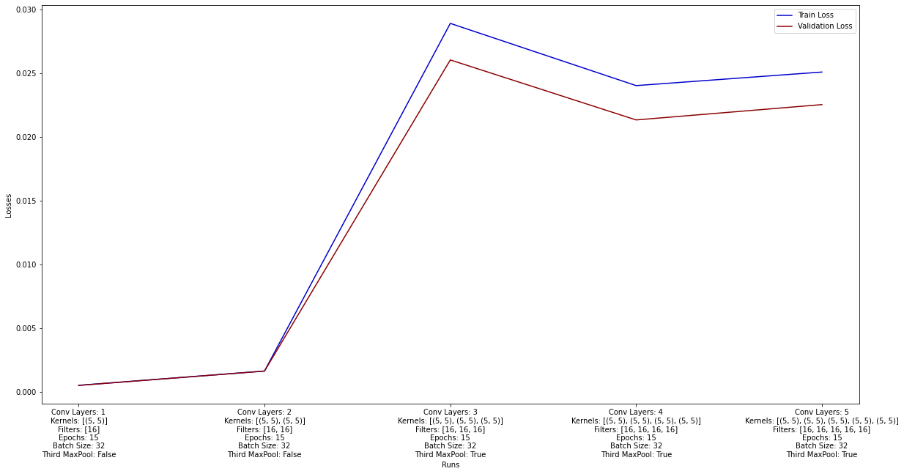
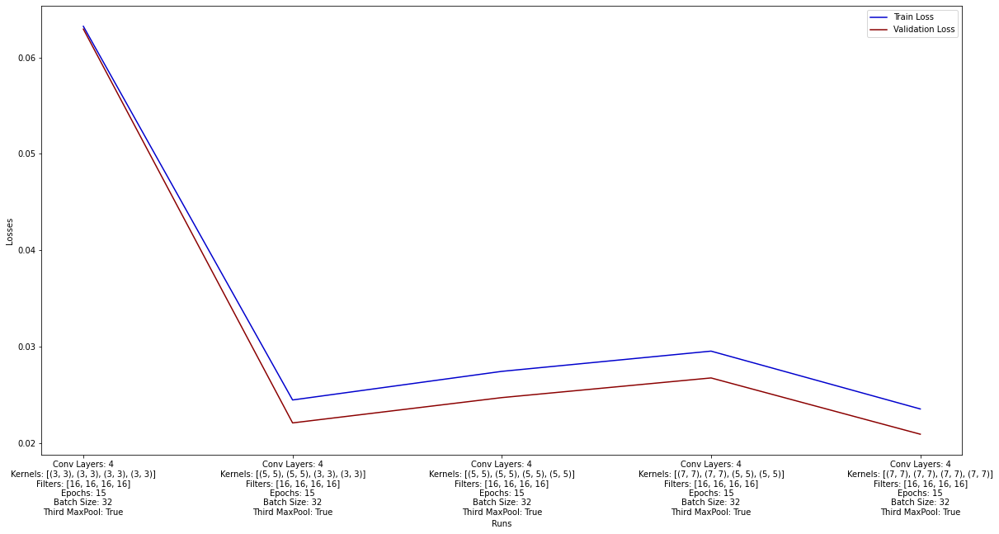
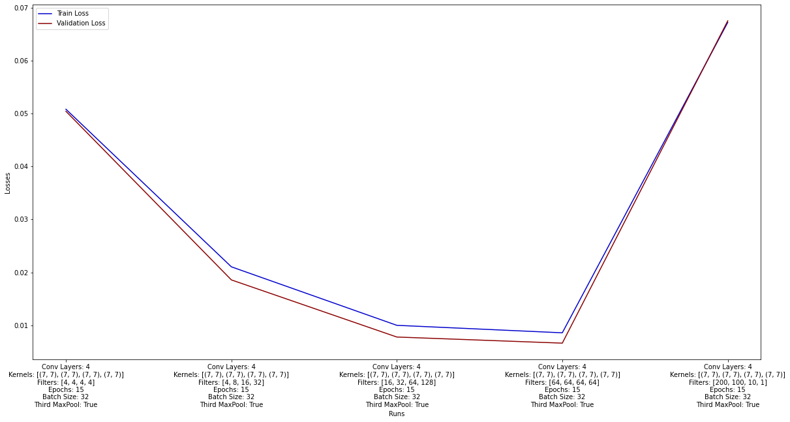
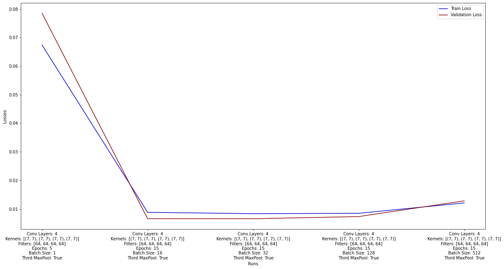
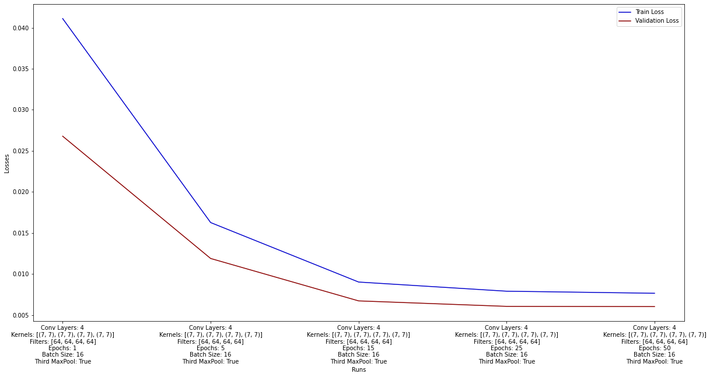
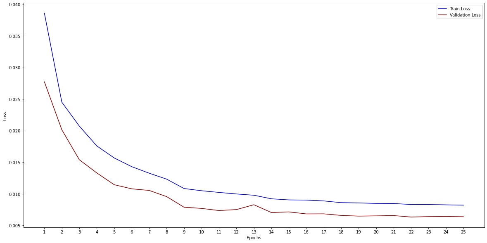
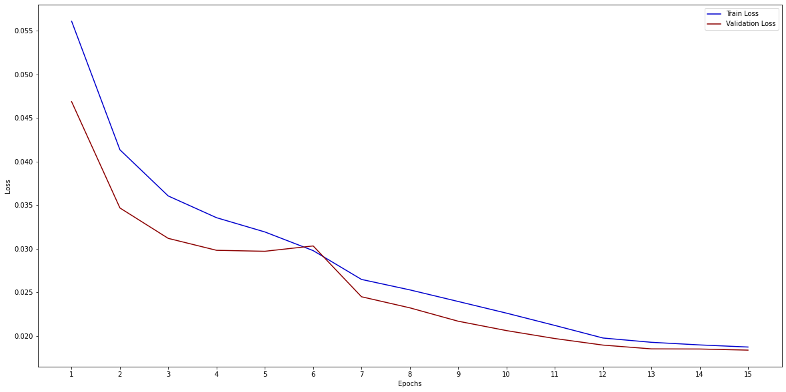
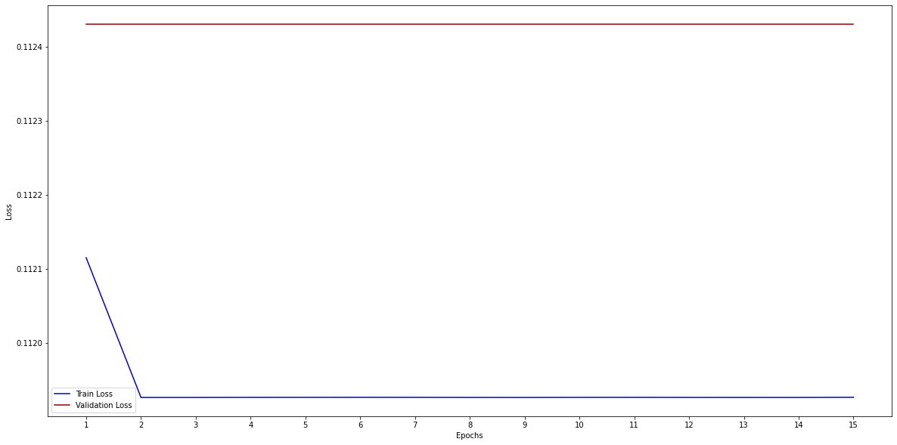
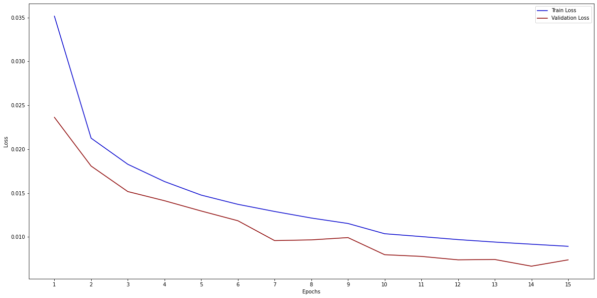

# Autoencoder Experimental Analysis

## Usage of third MaxPooling Layer
Firstly, let's state that an implementation of a Convolutional Autoencoder where the dimension of the latent vector is not MUCH smaller than the dimension of the input, does NOT make sense.

The target of the Autoencoder is to learn a lower-dimension representation of the input data. With that said, it only makes sense to use a third MaxPooling layer in order to further reduce the output of the encoder. That's why in our experiments we will be using it. But just for the sake of completion, let's make a sanity check at what happens if we don't use a third max pooling layer:

As expected, we see that even one of the most "basic" models without a third max pooling layer, beats all the other models by far. This is due to the fact that the model without the third maxpool keeps a wider variety of features in the bottleneck (7 x 7 x filters_in_last_conv_layer), allowing it to learn the original data better.
   

## Convolutional Layers
Let's see what happens if we steadily increase the number of Convolutional Layers, while we keep the other hyperprameters untouched (except for kernel sizes and filters, but the same will be added):

As expected, since for 1 Convolutional Layer the image keeps the "most" information, that is, it doesn't go through a second Max Pooling, the performance is better. After the third layer where we have applied 3 Max Pooling operations, and the output of the encoder has shape (1, 1, #of_filters_in_last_layer), it is much harder for the decoder to reconstruct the actual image, thus increasing the loss. An important takeaway here is that the model seems to be performing better with 4 Convolutional Layers than with 3, therefore we can keep this number for the rest of the experiments.
   

## Kernel Sizes
Let's see what happens if we steadily increase the dimension of the convolutional kernel, while keeping the other hyperparameters untouched:

Again, as expected, the model with the "wider" kernels performed the best (0.0209 validation mse). This is due to the fact that wider kernels allow each output feature of the convolution to "gather" more information from neighboring pixels, making it more robust to outliers and noisy pictures (e.g.: a 4 written like a 9). We will keep these kernel sizes [(7, 7), (7, 7), (7, 7), (7, 7)] for the next experiments.
   

## Number of filters
Let's see what happens if we steadily increase the number of filters per convolutional layer, while keeping the other hyperparameters untouched:

Three different approaches were tried
1. Keeping constant the number of filters for each layer.
2. Increasing the number of filters up to the last layer of the encoder.
3. Decreasing the number of filters up to the last layer of the encoder.

As expected, the second category of models outperforms the others. This is due to the fact that as the number of filter per convolutional layer increase, the latent vector (aka the last convolutional layer of the encoder) will have a larger dimension, thus reducing the information loss that occurs, and allowing the decoder to perform better.
   

## Batch Size
Let's see what happens if we steadily increase the batch size, while keeping the other hyperparameters untouched:

A Batch size of 16 seems to be working the best. Up to a batch size of 128 the losses seem to remain steady. Higher than that, led to increase of the losses. This was expected, as Yann LeCun suggests [here](https://twitter.com/ylecun/status/989610208497360896?lang=en).
   

## Number of epochs
Let's see what happens if we steadily increase the number of epochs, while keeping the other hyperparameters untouched:

We can see that even though in every model trained the weights are initialized randomly, after about 25 epochs they start converging to a local minimum. So that could be considered a good place to stop.
   

## Loss vs Epochs Graph
Below we present the Loss vs Epochs graph of the best model so far:

Note that the best model
- Has 4 Convolutional Layers
- Has [(7, 7), (7, 7), (7, 7), (7, 7)] kernel sizes per convolutional layer
- Has [64, 64, 64, 64] filters per convolutional layer
- Has a Batch size of 16
- Was trained in 25 epochs
- Used a third MaxPooling layer to further reduce the dimension of its encoding
   

## Other experiments
Some more experiments were run, using the best model found above as a base model. We list them below:

1. In the architecture of the Autoencoder, we tried to switch the "sets" of layers 
    - "Convolutional-BatchNormalization-MaxPooling"

        with "sets" of
    - "Convolutional-BatchNormalization-Convolutional-BatchNormalization-MaxPooling". 

        No improvement was shown for 2-3 runs, so the idea was disregarded.
        
    Below we can see a graph of the performance of the model with that architecture for one run:

    

2. Removing Batch Normalization increases both losses by a factor bigger than 10, as the activations become a bit unstable in some layers.

    

    I believe the graph speaks for itself.

3. Using Leaky ReLU with alpha = 0.15, instead of regural ReLU, decreased a bit the performance, but the damage could be considered negligible. Maybe the learning was slower. In the graph below we can see Loss in every epoch:

    

   

## Environment
- These experiments were run using Colab, since it allows us to use its GPU. The relevant Notebook can he found in the [Notebook](../Notebook) directory.

- Also note that in order to run the above experiments, only small modifications need to be made in the code. Since the code is parametric, only a few method arguments need to be tuned in order to reproduce the experiments. And in the case of the other architecture, then only 2 hunks of code should be uncommented in the methods that create the encoder and the decoder respectively.
