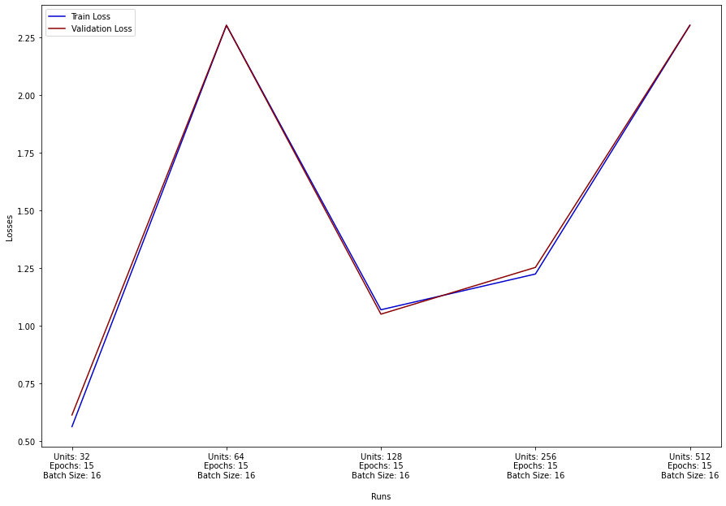

# Classifier Experimental Analysis

## Usage of Encoder
For the following experiments, two different encoders generated by the 1st part of this project will be used:
1. Encoder 1 Configuration:
    1. Conv Layers = 4
    2. Kernel Sizes = (7, 7), (7, 7), (7, 7), (7, 7)
    3. Filters = [64, 64, 64, 64]
    4. Epochs = 15
    5. Batch Size = 16
    6. Usage of Third Max-Pooling = False
2. Encoder 2 Configuration:
    1. Conv Layers = 3
    2. Kernel Sizes = (7, 7), (7, 7), (7, 7)
    3. Filters = [64, 64, 64]
    4. Epochs = 15
    5. Batch Size = 16
    6. Usage of Third Max-Pooling = True
  
  
## Number of Units
The following images display the results of the classifier when only the number of units is tweaked while everything else remains the same.
Analytically, the hyperparameter values that we will use for both encoder models are: 
- Epochs = 15
- Batch Size = 16

#### Encoder 1

We can clearly see that validation loss is actually increasing while we increase the number of units in the fully-connected layer. On the other side, training loss is decreasing. Hence, we can deduce that more units will lead to easier overfitting of the model.

#### Encoder 2

In comparison with the 1st encoder, the results are horrendous, the highest validation loss was at 0.14 on 512 units. In this experiment, the lowest validation loss is 0.625. This is achieved on 32 units. It may be the best option among them, but it remains terrible. It seems that the usage of 3rd Max Pooling has significantly hindered the model's ability to predict correctly.

## Number of epochs
The following images display the results of the classifier when only the number of epochs is tweaked while everything else remains the same.
Analytically, the hyperparameter values that we will use for both encoder models are: 
- Units = 64
- Batch Size = 16

#### Encoder 1

#### Encoder 2

## Batch Size
The following images display the results of the classifier when only the batch size is tweaked while everything else remains the same.
Analytically, the hyperparameter values that we will use for both encoder models are: 
- Units = 64
- Epochs = 15

#### Encoder 1

#### Encoder 2

## Environment
- These experiments were executed using Colab, since it allows us to use its GPU. The relevant Notebook can he found in the [Notebook](../Notebook) directory.

- Also note that in order to run the above experiments, only small modifications need to be made in the code. You are free to experiment however you want, keep in mind that the usage of it is more "dev-oriented". We have removed the interface methods and the user needs to simply set the parameter's values to the way he sees fit.
