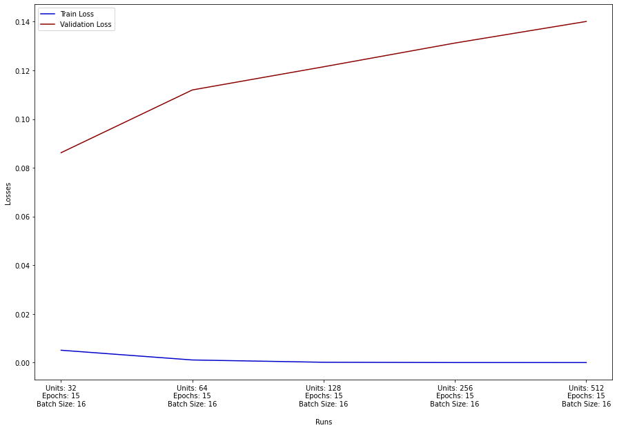

# Classifier Experimental Analysis

## Usage of Encoder
For the following experiments, two different encoders generated by the 1st part of this project will be used:
1. Encoder 1 Configuration:
  1. Conv Layers = 4
  2. Kernel Sizes = (7, 7), (7, 7), (7, 7), (7, 7)
  3. Filters = [64, 64, 64, 64]
  4. Epochs = 15
  5. Batch Size = 16
  6. Usage of Third Max-Pooling = False
2. Encoder 2 Configuration:
  1. Conv Layers = 3
  2. Kernel Sizes = (7, 7), (7, 7), (7, 7)
  3. Filters = [64, 64, 64]
  4. Epochs = 15
  5. Batch Size = 16
  6. Usage of Third Max-Pooling = True
  
  
## Number of Units
The following images display the results of the classifier when only the number of units is tweaked while everything else remains the same.
Analytically, the hyperparameter values that we will use are: Epochs = 15, Batch Size = 16 for the two encoder models.

#### Encoder 1

We can clearly see that validation loss is acutally increasing while we increase the number of units in the fully-connected layer. On the other side, training loss is decreasing. Hence, we can deduce that more units will lead to easier overfitting of the model.

#### Encoder 2

## Number of epochs

#### Encoder 1

#### Encoder 2

## Batch Size

#### Encoder 1

#### Encoder 2

## Environment
